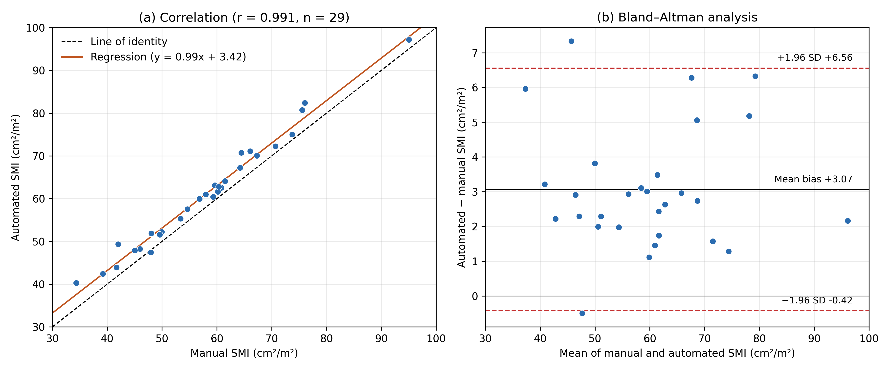
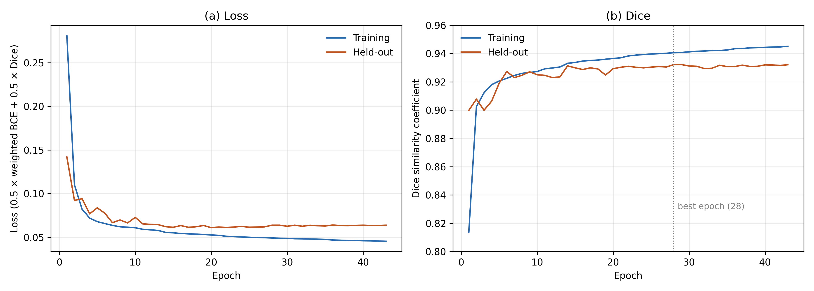
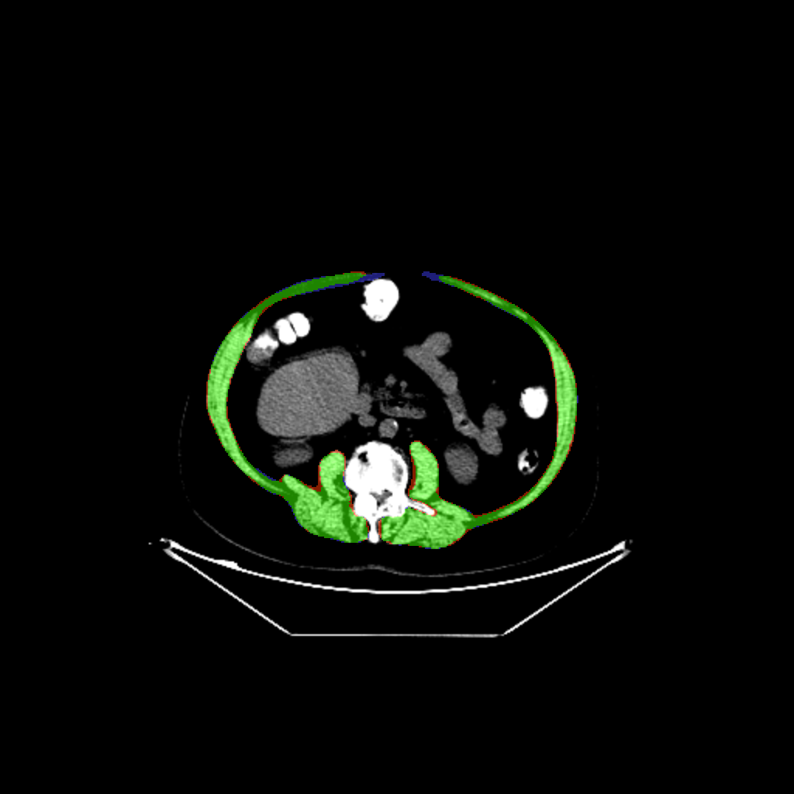

# 2.5D U-Net for CT-based skeletal muscle segmentation and sarcopenia detection

Code, trained model and anonymised results for automated multi-slice skeletal muscle segmentation at the L3 level on CT (PET/CT attenuation-correction CT) and skeletal muscle index (SMI)–based sarcopenia classification in lung cancer patients.

> **No patient data are included.** DICOM, NIfTI, NumPy arrays, contour files and clinical spreadsheets are excluded (see `.gitignore`). Result tables use random study IDs.

## Method in brief

| Step | Script | Description |
|---|---|---|
| 1 | `src/prepare_25d_data.py` | Reads CT DICOM + RTSTRUCT contours, builds binary masks, computes SMI (mean muscle area over all annotated L3-level slices / height²) and writes 2.5D samples (slices z−1, z, z+1 → 512×512×3; target = mask of slice z). Clinical data (height, weight, age, sex) are read from an Excel file; the train/test split from `hasta_bolme.csv`. |
| 2 | `src/check_25d_data.py` | Sanity checks of the generated samples, mask statistics, preview figure. |
| 3 | `src/train_unet25d.py` | 4-level 2D U-Net (32→512 filters, 7.77 M parameters), loss = 0.5·weighted BCE (w⁺=8) + 0.5·Dice, Adam 1e-4, batch 2, early stopping. |
| 4 | `src/test_unet25d_interactive.py` | Evaluation on the held-out set (Dice, IoU, sensitivity, specificity, precision, SMI agreement) with an interactive viewer to save selected panels. |
| 5 | `src/export_binary_masks.py` | Exports black-and-white ground-truth / predicted masks. |
| – | `src/train_deeplab_unetr.py`, `src/test_deeplab_unetr.py` | Experimental DeepLab-ASPP + UNETR hybrid model (comparison). |

HU values are clipped to [−29, 150] and scaled to [0, 1]. Sarcopenia is defined with the Prado et al. (2008) cut-offs (men < 52.4, women < 38.5 cm²/m²).

## Results (held-out test set: 30 CT examinations, 652 slices)

| Metric | Value |
|---|---|
| Dice | 0.932 ± 0.016 (95% CI 0.926–0.938) |
| IoU | 0.873 ± 0.027 |
| Sensitivity / precision | 0.958 / 0.908 |
| SMI Pearson r / ICC(2,1) | 0.991 / 0.965 |
| SMI bias (automated − manual) | +3.07 cm²/m² (LoA −0.42 to +6.56) |
| Sarcopenia (Prado) sensitivity / specificity | 9/9 / 20/20 |

Per-patient results: `results/test_results_per_patient.csv`; all metrics: `results/summary_metrics.json`; cohort characteristics: `results/cohort_summary.csv`.



**Note:** the held-out set was also used for early stopping/checkpoint selection, so the results may be slightly optimistic; external validation is pending. The model is applied to the L3-level slices defined by the reference contours (no automatic L3 localisation yet).

## Trained model

`models/unet25d_512_20260928_1700/en_iyi.keras` (best epoch 28/43) with its training log and metadata. Load with:

```python
import tensorflow as tf
model = tf.keras.models.load_model("models/unet25d_512_20260928_1700/en_iyi.keras", compile=False)
# input: (N, 512, 512, 3) float32 in [0, 1] = HU clipped to [-29, 150] for slices z-1, z, z+1
```

## Usage

```bash
pip install -r requirements.txt          # Python 3.10, TensorFlow 2.10 (GPU)
set SARKOPENI_DIR=D:\path\to\project      # Windows; default is E:\sarkopeni
python src/prepare_25d_data.py
python src/check_25d_data.py
python src/train_unet25d.py
python src/test_unet25d_interactive.py
```

Expected layout of `SARKOPENI_DIR`: `DATA/<patient>/CT*.dcm + struct*.dcm`, `Hasta_bilgileri.xlsx`, `output/egitim_25d/hasta_bolme.csv`.



### Example predictions (`results/images/`)

Centre-slice outputs for 24 test patients, named with the same random study IDs as `results/test_results_per_patient.csv` (no names or identifiers):

| File | Content |
|---|---|
| `Txx_prediction.png` | Model prediction (orange) overlaid on CT |
| `Txx_overlap.png` | Overlap with the reference: green = true positive, red = false positive, blue = false negative |
| `Txx_overlap_magnifiedN.png` | Magnified view of the overlap |
| `Txx_prediction_binary.png` | Binary prediction mask (white = muscle) |



## License

Code released under the MIT License (see `LICENSE`). The trained model is provided for research use only; it is not a medical device.

## Citation

Manuscript in preparation. Ethics approval: Istanbul University-Cerrahpaşa Non-Interventional Clinical Research Ethics Committee (2026/284).
